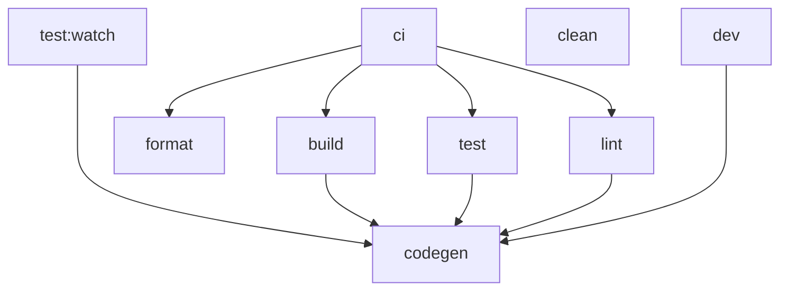
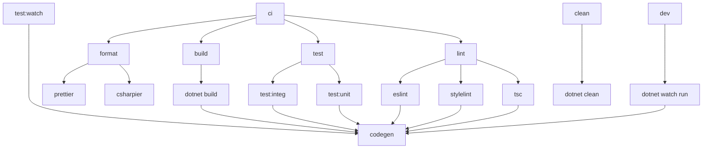

# Nx polyglot example

Example [Nx] monorepo with multiple languages (polyglot).

**Table of contents**

- [My goals](#my-goals)
- [About](#about)
- [Workspace structure](#workspace-structure)
- [Getting started](#getting-started)
- [Glossary](#glossary)
- [Build targets](#build-targets)
- [Dependency management](#dependency-management)

## My goals

1. Learn more about [Nx]
2. Showcase a polyglot monorepo and its benefits
3. Define (my) standard build targets

## About

This repository (a.k.a. the solution or workspace) contains npm (TypeScript) and .NET (C#) projects.
Nx orchestrates the build process across both build tools (`npm` and `MSBuild`).

Nx caches task results, handles execution order, and can run only “affected” tasks; all of which speed up local development.
In the future I will explore remote caching to improve CI builds.

## Workspace structure

### Directories

An overview of the root directories follows.
Refer to the [§ Glossary](#glossary) for clarity on any terms.

- `.husky`: Git hooks

- `apps`: Applications

- `libs`: Libraries

- `tools`: Scripts

- Repository-wide configuration files live in the root directory

> **Note**
>
> I have used a flat, two-tier structure of projects during my initial exploration.
> However, this may move to a three-tier structure that partitions based on application (or technology).
> See [“Using Nx at Enterprises”][nx-enterprise].

### Project naming conventions

Projects reside within the `apps` and `libs` directories.
They should follow the naming conventions of their technology.

For example, npm/Node projects use `lower-kebab-case-like-this`
and .NET projects use `Namespaced.PascalCase.LikeThis`.

## Getting started

To build and run this project, you need `npm` (`node`) and `dotnet` installed.
Refer to the official docs (below) or follow your personal preference or company’s guidance.

- [“Downloading and installing Node.js and npm”](https://docs.npmjs.com/downloading-and-installing-node-js-and-npm)
- [“Download .NET”](https://dotnet.microsoft.com/en-us/download)

Complete the following steps to build and run an application.

1. Verify installation

   ```shell
   node -v
   npm -v
   dotnet --version
   ```

2. Install node dependencies

   ```shell
   npm clean-install # npm ci
   ```

3. Install `nx` globally.

   ```shell
   npm install --global nx@latest
   ```

   Installing globally allows running commands without the `npx` prefix.
   The global `nx` will use the locally installed (`npm ci`) version for consistency.

4. Build and run an application.

   ```shell
   nx ci # Executes a “full” CI build
   # TODO: Run an application
   ```

> **Warning**
>
> I used [OpenAPI Generator][openapi-generator] to generate the C# server stub.
> It requires Java to run, so I may need to add Java install, too.
>
> However, I hope to replace Open API generator with TypeSpec’s built-in generator.
> [See TypeSpec#2458 on GitHub](https://github.com/microsoft/typespec/pull/2458).

## Glossary

### Application

A [**project**](#project) that runs on its own;
a deployed unit (along with its dependent [**libraries**](#library)).
It matches the [Container term in the C4 model][c4model].

Applications reside in the `apps` directory.
See [Nx’s “Applications and libraries”][nx-apps-and-libs].

### Build target

An action taken on a project; for example, `build` or `test`.
See [§ Build targets](#build-targets).

A **build target** may define **sub-targets**, which break up the work into individually executable units.

Some related, but different, terms follow.

- Command: Something a developer types into the terminal.
- Run script: npm-specific term for targets/tasks.
- Task: An invocation of a target on a specific project.
  _Note that this definition matches [Nx’s term][nx-task] and not [MSBuild’s][msbuild-task]._

### CI

Continuous integration; the practice of executing the full, automated build regularly.

The phrase “in CI” refers to the “official” execution of builds on the CI server.
The `ci` build target represents the majority of the execution for that build on the CI server.

### Library

A [**project**](#project) that is used by [**applications**](#application) or other **libraries**.

Libraries reside in the `libs` directory.
See [Nx’s “Applications and libraries”][nx-apps-and-libs].

### Monorepo

A single repository containing multiple projects with well-defined relationships.
See [monorepo.tools][monorepo-tools].

### Nx

A build system built by Nrwl with first-class monorepo support.
See [nx.dev][nx].

### Polyglot

Multiple programming languages.
See [“Polyglot (computing)” on Wikipedia][polyglot].

### Project

An individual unit (think module) of functionality.
Synonymous with .NET project or npm package.
Applications and libraries both represent projects.

### Repository

The git repository and all of its code/files.
_Also known as **Solution** and **Workspace**._

- **Repository** used when emphasizing the git or raw files aspect.
- **Solution** used when emphasizing the library and application code, given they solve problems (provide value).
  - **.NET Solution**: Used when explicitly referencing the .NET (C#) concept: [“What are solutions and projects?”][dotnet-solutions-and-projects]
- **Workspace**: Used when emphasizing the collection of projects or discussing build orchestration.

### Solution

_See [**Repository**](#repository)_

### Workspace

_See [**Repository**](#repository)_

## Build targets

Goal 3 seeks to standardize build targets across projects and programming languages.
This sections provides an introduction into this standardization and then goes into each standard build target in more depth.

### Standardizing build targets

While a polyglot workspace could have a different set of build targets per language or paradigm,
I believe standardizing the build targets across all projects and languages improves the developer experience.
This lessens the learning curve for a developer entering a different part of the solution.

Where applicable, I have chosen the .NET term for a target.
npm has a few standards, with some common targets popularized in the community,
but I have found npm developers expect to check the run scripts and can easily adjust.
At the original time of writing, I focused on these two technologies primarily.

I also referenced the [Java Plugin for Gradle][gradle-java] as a third source of target names.

### Build target overview

The set of standard build targets form a task pipeline.
(I have also called this the build or orchestration lifecycle.)
The following diagram shows a high-level overview of the targets and their dependencies.



<details>
<summary><b>Detailed diagram with sub-targets</b></summary>

The following diagram shows the build lifecycle in more detail.
It includes the sub-targets, but omits the `*:fix` variants.



</details>
<p></p>

The following lists the standard targets in, roughly, their execution order.
Due to the pipeline existing as a graph across projects and allowing parallelism,
a list does not accurately represent the standard targets.
To visualize the exact target graph, run `nx graph`.

- `codegen`: Generates code from an already available source.

- `build`: Builds the project (may include compilation).

- `test`: Runs (unit) tests with code coverage.

- `format`: Ensures proper formatting.

- `lint`: Ensures code quality through linting rules.

- `dev`: Starts a development server.

- `clean`: Cleans (removes) the output of previous builds.

These standard targets depend on tool-specific sub-targets to properly orchestrate the build in a polyglot workspace.
For example, the `build` task depends on `dotnet build` and `vite build`.

Using target dependencies this way allow developers to always use the target (example: `build`) and not worry about which technology or tool to use.
It also restricts most target (command) logic to `nx.json` without needing to use Nx executors.

### `ci` target

The `ci` target exists in the root project.
It defines the targets that are run as part of the CI build.

### `codegen` target

The `codegen` target generates code from an already available source.

Projects should define their own dependencies for `codegen` as needed.
(For example, copying files or requiring a dependant project’s `codegen` or `build`.)

### `build` target

The `build` target builds the project.
Depending on the language, this includes compilation (or transpilation).
The `build` target produces the artifact to run (a DLL for C#, a jar for Java, or a bundle for JS).

The sub-targets follow.
Their name matches the tool and subcommand used.

- `dotnet build`
- `tsp compile`
- `vite build`

### `test` target

The `test` target runs the tests for the project as it should run in CI.
This means that the `test` target collects code coverage.

> **Note**
>
> I have not committed to the single `test` target.
> I still want to consider additional viewpoints on two targets: `test` and `coverage`.
>
> Additional note: `test:system` may need move to its own top-level target.
>
> 1. It is not cacheable, while the other two are.
> 2. It depends on build, while the other two do not.
> 3. It does not (usually) have a coverage collection mechanism, while the other two do.

The `test` target defines three sub-targets: `unit`, `integ` (integration), and `system`.
These sub-targets originate from the three primary testing levels.
See [“Software Testing § Testing levels” on Wikipedia][testing-levels].

> **Warning**
>
> I have removed `test:system` sub-target (at least for now).

The `unit` and `integ` sub-targets should not require a full build, but the `system` does.
Projects that define `test:system` must customize the target to start the application under test.

Projects can optionally define a `test:watch` target that starts the tests (or a subset of the tests) in “watch” mode.
Alternatively, the project can provide commands in its README on how to run these.

There is not a separate `coverage` test target.
Coverage will run in CI and should be fast enough to run locally, which counters the main reason to have separate targets.

### `format` target

The `format` target ensures proper formatting.
“Formatting” refers to the “display” of the code: predominantly the use of whitespace.

Unless a language provides its own strict formatter (such as `go fmt`), projects should use [Prettier].
Given the use of [Nx], Node (and prettier) already exist in the repository, so using it for more languages simplifies configuration (including IDE set up).

The `format` target _checks_ for proper formatting, and it fails the build if it detects an issue.
It depends on tool-specific tasks (example: `prettier`).

The `format:fix` target exists (only at the root) for applying (fixing) the formatting.
You should configure your IDE to format on save, so that you do not have to run this.
The pre-commit hook should also apply formatting (see [lint-staged.config.cjs](./lint-staged.config.cjs)).

### `lint` target

The `lint` target ensures code quality through linting rules.
Projects should NOT configure stylistic rules related to formatting.
Instead, the `format` target should handle those.

Some programming languages, such as C# and Java, provide “lint flags” as part of their compiler.
This `lint` target does NOT include run those lint flags, but they are a part of code quality verification.
(The `build` target would handle those.)

The `lint` target defines many sub-targets.
Each maps to a specific tool that may span multiple projects.
Feel free to add a new tool and sub-target.
For clarity, the sub-targets use the tool’s name as the target name.

- `eslint`: ESLint linting rules (many languages).

- `tsc`: TypeScript type checking (`tsc`) as a form of linting (TypeScript).

  _Note: Some folks consider type-checking as a pre-build step.
  I recommend it as an independent linting step to allow builds (especially a running development server) to execute without failing due to type issues in languages like Python or JavaScript/TypeScript._

The `lint` target _checks_ for code quality violations, and it fails the build if it detects an issue.

The `lint:fix` target exists for fixing auto-fixable lint rule violations.
Only some sub-targets provide a `*:fix` rule.
As a result, you will probably just run the root `lint:fix` most of the time.

You can also configure your IDE (per tool) to fix on save, so that you do not have to run `lint:fix`.
The pre-commit hook should also apply fixes (see [lint-staged.config.cjs](./lint-staged.config.cjs)).

### `dev` target

The `dev` target starts a development server that runs the application.
This should include hot module reloading (HMR) or the language’s equivalent.
It likely starts in “debug” or “development” mode.

The `dev` target should not depend on a full `build`.

### `clean` target

The `clean` target cleans (removes) the output of previous builds.
It should NOT delete cached dependencies.

## Dependency management

The workspace manages all dependencies in root files to simplify dependency management across projects.
This structure matches the [integrated repository approach][nx-integrated-repos].

### npm dependencies

The workspace manages all npm dependencies in the [root package.json](./package.json).

While `dependencies` and `devDependencies` do not have an impact on the final bundle,
attempt to keep test-only or build-only dependencies in the `devDependencies` group.
This can provide some insight at-a-glance to a new developer regarding runtime dependencies.

### NuGet dependencies

The workspace manages all NuGet dependencies in the [root Directory.Packages.props](./Directory.Packages.props).
This leverages [NuGet’s Central Package Management (CPM)][nuget-cpm].

_Note: Individual .NET projects still reference their dependencies in their project files but without a version._

[c4model]: https://c4model.com
[dotnet-solutions-and-projects]: https://learn.microsoft.com/en-us/visualstudio/ide/solutions-and-projects-in-visual-studio?view=vs-2022
[gradle-java]: https://docs.gradle.org/current/userguide/java_plugin.html
[monorepo-tools]: https://monorepo.tools
[msbuild-task]: https://learn.microsoft.com/en-us/previous-versions/visualstudio/visual-studio-2015/msbuild/msbuild-tasks
[nuget-cpm]: https://learn.microsoft.com/en-us/nuget/consume-packages/Central-Package-Management
[nx]: https://nx.dev/
[nx-apps-and-libs]: https://nx.dev/concepts/more-concepts/applications-and-libraries
[nx-enterprise]: https://nx.dev/concepts/more-concepts/monorepo-nx-enterprise
[nx-integrated-repos]: https://nx.dev/concepts/integrated-vs-package-based
[nx-task]: https://nx.dev/core-features/run-tasks
[openapi-generator]: https://openapi-generator.tech
[polyglot]: https://en.wikipedia.org/wiki/Polyglot_(computing)
[prettier]: https://prettier.io
[testing-levels]: https://en.wikipedia.org/wiki/Software_testing#Testing_levels
