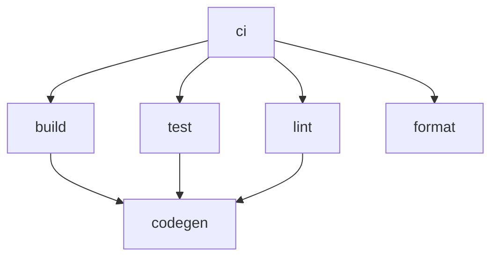
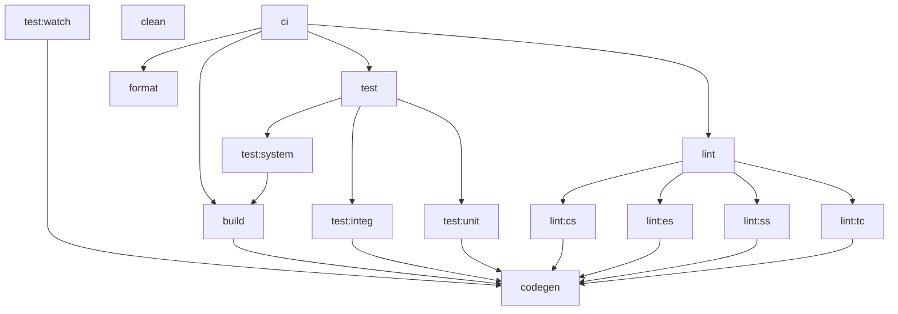

# Nx polyglot example

Example [Nx] monorepo with multiple languages (polyglot).

**Table of contents**

- [My goals](#my-goals)
- [About](#about)
- [Glossary](#glossary)
- [Build targets](#build-targets)

## My goals

1. Learn more about [Nx]
2. Showcase a polyglot monorepo and its benefits
3. Define (my) standard build targets

## About

This repository (a.k.a. the solution or workspace) contains npm (TypeScript) and .NET (C#) projects.
Nx orchestrates the build process across both build tools (`npm` and `MSBuild`).

Nx caches task results, handles execution order, and can run only “affected” tasks; all of which speed up local development.
In the future I will explore remote caching to improve CI builds.

## Glossary

### Build target

An action taken on a project; for example, `build` or `test`.
See [§ Build targets](#build-targets).

A **build target** may define **sub-targets**, which break up the work into individually executable units.

Some related, but different, terms follow.

- Command: Something a developer types into the terminal.
- Run script: npm-specific term for targets/tasks.
- Task: An invocation of a target on a specific project.
  _Note that this definition matches [Nx’s term][nx-task] and not [MSBuild’s][msbuild-task]._

### CI

Continuous integration; the practice of executing the full, automated build regularly.

The phrase “in CI” refers to the “official” execution of builds on the CI server.
The `ci` build target represents the majority of the execution for that build on the CI server.

### Monorepo

A single repository containing multiple projects with well-defined relationships.
See [monorepo.tools][monorepo-tools].

### Nx

A build system built by Nrwl with first-class monorepo support.
See [nx.dev][nx].

### Polyglot

Multiple programming languages. 
See [“Polyglot (computing)” on Wikipedia][polyglot].

### Project

An individual unit (think module) of functionality.
Synonymous with .NET project or npm package.
Applications and libraries both represent projects.

### Repository

The git repository and all of its code/files.
_Also known as **Solution** and **Workspace**._

- **Repository** used when emphasizing the git or raw files aspect.
- **Solution** used when emphasizing the library and application code, given they solve problems (provide value).
  - **.NET Solution**: Used when explicitly referencing the .NET (C#) concept: [“What are solutions and projects?”][dotnet-solutions-and-projects]
- **Workspace**: Used when emphasizing the collection of projects or discussing build orchestration.

### Solution

_See [**Repository**](#repository)_

### Workspace

_See [**Repository**](#repository)_

## Build targets

Goal 3 seeks to standardize build targets across projects and programming languages.
This sections provides an introduction into this standardization and then goes into each standard build target in more depth.

### Standardizing build targets

While a polyglot workspace could have a different set of build targets per language or paradigm,
I believe standardizing the build targets across all projects and languages improves the developer experience.
This lessens the learning curve for a developer entering a different part of the solution.

Where applicable, I have chosen the .NET term for a target.
npm has a few standards, with some common targets popularized in the community,
but I have found npm developers expect to check the run scripts and can easily adjust.
At the original time of writing, I focused on these two technologies primarily.

I also referenced the [Java Plugin for Gradle][gradle-java] as a third source of target names.

### Build target overview

The set of standard build targets form a task pipeline.
(I have also called this the build or orchestration lifecycle.)
The following diagram shows a high-level overview of the targets and their dependencies.

Detailed diagram with sub-targets

The following diagram shows the build lifecycle in more detail.
It includes the sub-targets, but omits the `*:fix` variants.

The following lists the standard targets in, roughly, their execution order.
Due to the pipeline existing as a graph across projects and allowing parallelism,
a list does not accurately represent the standard targets.
To visualize the exact target graph, run `nx graph`.

- `codegen`: Generates code from an already available source.

- `build`: Builds the project (may include compilation).

- `test`: Runs (unit) tests with code coverage.

- `format`: Ensures proper formatting.

- `lint`: Ensures code quality through linting rules.

- `clean`: Cleans (removes) the output of previous builds.

### `ci`

The `ci` target exists as the root target.
It defines the targets that are run as part of the CI build.

### `codegen`

The `codegen` target generates code from an already available source.

By default, it has no dependencies **including no dependency on dependent projects**.
This zero-default-dependencies rule exists purely as a build optimization for parallelism.
Projects should define their own dependencies for `codegen` as needed.
(For example, copying files or requiring a dependant project’s `codegen` or `build`.)

### `build`

The `build` target builds the project.
Depending on the language, this includes compilation (or transpilation).
The `build` target produces the artifact to run (a DLL for C#, a jar for Java, or a bundle for JS).

### `test`

The `test` target runs the tests for the project as it should run in CI.
This means that the `test` target collects code coverage.

> **Note**
> 
> I have not committed to the single `test` target.
> I still want to consider additional viewpoints on two targets: `test` and `coverage`.

The `test` target defines three sub-targets: `unit`, `integ` (integration), and `system`.
These sub-targets originate from the three primary testing levels.
See [“Software Testing § Testing levels” on Wikipedia][testing-levels].

The `unit` and `integ` sub-targets should not require a full build, but the `system` does.
Projects that define `test:system` must customize the target to start the application under test.

Projects can optionally define a `test:watch` target that starts the tests (or a subset of the tests) in “watch” mode.
Alternatively, the project can provide commands in its README on how to run these.

There is not a separate `coverage` test target.
Coverage will run in CI and should be fast enough to run locally, which counters the main reason to have separate targets. 

### `format`

The `format` target ensures proper formatting.
“Formatting” refers to the “display” of the code: predominantly the use of whitespace.

Unless a language provides its own strict formatter (such as `go fmt`), projects should use [Prettier].
Given the use of [Nx], Node (and prettier) already exist in the repository, so using it for more languages simplifies configuration (including IDE set up).

The `format` target _checks_ for proper formatting, and it fails the build if it detects an issue.
The `format:fix` target exists for applying (fixing) the formatting.

### `lint`

The `lint` target ensures code quality through linting rules.
Projects should NOT configure stylistic rules related to formatting; instead, the `format` target should handle those.

Some programming languages, such as C# and Java, provide “lint flags” as part of their compiler.
This `lint` target does NOT include run those lint flags, but they are a part of code quality verification.
(The `build` target would handle those.)

The `lint` target defines many sub-targets.
Each maps to a specific tool that may span multiple projects.
Feel free to add a new tool and sub-target.
For brevity, the sub-targets have a two-character name.

- `lint:cs`: StyleCop linting rules (C#).
  _`cs` for **CS**harp (C#)`_

- `lint:es`: ESLint linting rules (many languages).
  _`es` for **ES**Lint._

- `lint:ss`: Stylesheet linting rules (css, scss, etc).
  _`ss` for **S**tyle**S**heets._

- `lint:tc`: Type checking as a form of linting (interpreted languages, `tsc` for TypeScript).
  _`tc` for **T**ype **C**hecking._

  _Note: Some folks consider type-checking as a pre-build step.
  I recommend it as an independent linting step to allow builds (especially a running development server) to execute without failing due to type issues in languages like Python or JavaScript/TypeScript._

The `lint` target _checks_ for code quality violations, and it fails the build if it detects an issue.
The `lint:*:fix` targets exist for fixing auto-fixable lint rule violations.
Only some sub-targets provide a `*:fix` rule.
As a result, you will probably just run the root `lint:fix` most of the time.

### `clean`

The `clean` target cleans (removes) the output of previous builds.
It should NOT delete cached dependencies.

[dotnet-solutions-and-projects]: https://learn.microsoft.com/en-us/visualstudio/ide/solutions-and-projects-in-visual-studio?view=vs-2022
[gradle-java]: https://docs.gradle.org/current/userguide/java_plugin.html
[monorepo-tools]: https://monorepo.tools
[msbuild-task]: https://learn.microsoft.com/en-us/previous-versions/visualstudio/visual-studio-2015/msbuild/msbuild-tasks
[nx]: https://nx.dev/
[nx-task]: https://nx.dev/core-features/run-tasks
[polyglot]: https://en.wikipedia.org/wiki/Polyglot_(computing)
[prettier]: https://prettier.io
[testing-levels]: https://en.wikipedia.org/wiki/Software_testing#Testing_levels
